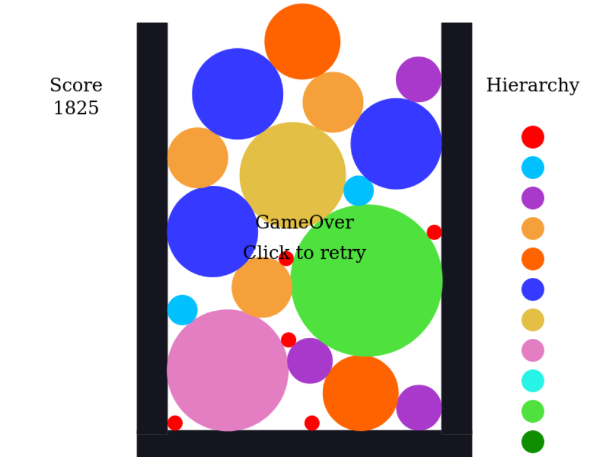

# Jsoo でスイカゲーム

たまに Web インターフェースを実装して人にツールを見せたいみたいなことがあると思うんですが,
普段強い型付け言語ばかり使っていると js(javascript) を書くのが辛くて苦悩します.
近年は TypeScript を書くのが流行りのようですが,
OCamler には Js_of_ocaml[^jsoo](以降 jsoo と略称) という回答があります.

今回は jsoo に入門します.

## Jsoo
ocaml ではある型 A の値からある型 B の値へ変換する関数は `B_of_A` とよくネーミングされますが,
その流れの通り, ocaml から js を生成するライブラリです.
ocaml で一般に使われるビルドシステムの dune[^dune] もサポートしていて,
dune ファイルに `(modes js)` とか書くだけで js のコードが生成されるようになります.

OCaml の標準ライブラリは　Sys とか Unix 辺りを除いてだいたいサポートされているようです.

### 実装例
公式ページ[^jsoo] にいくつか jsoo を使って生成したページ例があります.
何故かコードには直接飛べないんですが,
Github[^jsoo_examples] を見るとちゃんと置いてあります.

とはいえこれだけだと取っ掛かり辛くて困ったので,
私は [hackmd で転がっていた tutoreal](https://hackmd.io/@Swerve/HyhrqnFeF) とか
[google chart を移植する記事](https://camlspotter.hatenablog.com/entry/20111015/1318664763) を参考にしました.

## ライブラリ導入編
せっかくだし jsoo でなんか実装してみようかと考えていたところ,
巷でスイカゲームなるものが流行っているを思い出し,
今回お題にも丁度よいしゲームを自給自足できるという点でも良いと思い実装してみました.

js の物理エンジンが欲しいわけですが, 今回は検索して一番上に出てきた matter.js[^matter] というライブラリを採用しました.

### セットアップ
まずは公式のチュートリアル (https://github.com/liabru/matter-js/wiki/Getting-started) を動かすことを目標にします.

とりあえず ocaml のプロジェクトファイル(エントリーポイントとなるソースファイル(ここでは `main.ml` とする), と dune ファイル等)を作ります.

```dune
(executable
 (name main)
 (modes js)
 (preprocess (pps js_of_ocaml-ppx))
 (libraries js_of_ocaml))
```

次に matter.js をダウンロードし,
ダウンロードしたライブラリと jsoo で生成する js ファイルを html で読み込みます.

```html
<html>
  <body>
    <script type="text/javascript" src="./matter.min.js"></script>
    <script type="text/javascript" src="./_build/default/main.bc.js"></script>
  </body>
</html>
```

それから `main.ml` にサンプルの js を移植します.
実は `Js.Unsafe` module に, 与えた文字列をそのまま js の式として変換する関数 `eval_string` があるので,
ただ動かすだけならサンプルのコードを文字列としてこれに与えれば良いです.
```ocaml
open Js_of_ocaml

let _ =
  Js.Unsafe.eval_string "
// module aliases
var Engine = Matter.Engine,
    Render = Matter.Render,
    Runner = Matter.Runner,
    Bodies = Matter.Bodies,
    Composite = Matter.Composite;

// create an engine
var engine = Engine.create();

// create a renderer
var render = Render.create({
    element: document.body,
    engine: engine
});

// create two boxes and a ground
var boxA = Bodies.rectangle(400, 200, 80, 80);
var boxB = Bodies.rectangle(450, 50, 80, 80);
var ground = Bodies.rectangle(400, 610, 810, 60, { isStatic: true });

// add all of the bodies to the world
Composite.add(engine.world, [boxA, boxB, ground]);

// run the renderer
Render.run(render);

// create runner
var runner = Runner.create();

// run the engine
Runner.run(runner, engine);
"
```


最後に `dune build ./main.bc.js` を実行すると `_build/default/main.bc.js` が生成され, index.html が動くようになります.


ディレクトリ構造はこんな感じです.
```
.
├── _build
│   └── default
│       └── main.bc.js
├── dune
├── dune-project
├── index.html
├── main.ml
└── matter.min.js
```

### ocaml っぽくする Unsafe 編
これだけだとただ js のコードを埋め込んでいるだけなので, ocaml のコードっぽく移植していきます.

まずは
```js
var engine = Engine.create();
var render = Render.create({
     element: document.body,
     engine: engine
   });
```
を Unsafe を使って変換していきます.

- js の式は `pure_js_expr`
- メンバ関数の呼び出しは `meth_call 関数名 引数配列`
- プロパティへのアクセスは `get メンバ名` や `set メンバ名 値`
- object literal は `obj (プロパティ名と値のペアの配列)`
  - `inject` で適宜 `Unsafe.any` 型へ型強制する

で変換でき, 変換すると以下のようになります.

```ocaml
open Js

(* create an engine *)
(* var engine = Matter.Engine.create(); *)
let engine =
  Unsafe.meth_call
    (Unsafe.pure_js_expr "Matter.Engine")
    "create"
    [||]

(* create a renderer *)
(* var render = Matter.Render.create({
     element: document.body,
     engine: engine
   }); *)
let render =
  Unsafe.meth_call
    (Unsafe.pure_js_expr "Matter.Render")
    "create"
    [|
      Unsafe.obj
        [|
          ( "element",
            Unsafe.inject (Unsafe.get Dom_html.document (Js.string "body")) );
          "engine", Unsafe.inject engine;
        |];
    |]


let _ =
  (* js の engine 変数へ ocaml の engine を代入する *)
  Unsafe.set Unsafe.global "engine" engine;
  Unsafe.set Unsafe.global "render" render;
  Unsafe.eval_string "
  ...
  "
```

js の変数へ ocaml からは `pure_js_expr` を使ってアクセスできますが, ocaml の変数へ js から直接アクセスすることはできません.
そのため `eval_string` 中で `engine` や `render` 変数へアクセスするには,
js の変数として束縛する必要があります.
`Unsafe.set Unsafe.global "engine" engine;` はそのための処理で,
js のグローバルオブジェクトに直接 `engine` を追加しています.

### ocaml っぽくする ppx 編
上みたく `get`, `set`, `meth_call` を並べるのは見栄えが良くないですし, Unsafe モジュールの関数は `'a -> 'b` みたいな関数ばかりで型もほとんど付きません.
この問題は `js_of_ocaml-ppx` というプリプロセッサを使うことでそこそこ解決します (実は上の dune ファイルには既に記述していましたが).

```ocaml
(* create an engine *)
(* var engine = Matter.Engine.create(); *)
let engine = (Unsafe.pure_js_expr "Matter.Engine")##create ()

(* create a renderer *)
(* var render = Matter.Render.create({
     element: document.body,
     engine: engine
   }); *)
let render =
  (Unsafe.pure_js_expr "Matter.Render")##create
    (object%js
        val element = Dom_html.document##.body
        val engine = engine
    end)
```


| ppx | Unsafe |
|:-:|:-:|
| `hoge##fuga arg0 arg1 ...` | `meth_call hoge "fuga" [\| arg0; arg1; ...\|]` |
| `hoge##.fuga` | `get hoge "fuga"` |
| `hoge##.fuga := piyo` | `set hoge "fuga" piyo` |
| `object%js .. end` | `obj [\| .. \|]` |

ppx によって演算子 `##` と `##.` や `object%js` 記法が導入されて,
ocaml がより自然に js っぽく記述できるようになります.

ppx を導入するメリットは見た目だけではなくて,
それっぽい感じで型付けしてくれるというのもあります.
例えば `Matter.Render.create` は,
Unsafe に書いた場合だと推論のやりようがないですが,
ppx を使って書いた場合だと `< element : Dom_html.bodyElement Js.t Js.readonly_prop
; engine : 'a Js.readonly_prop > -> 'b` と推論されます[^ppx].
create の引数に渡している object のプロパティが型として現れているのがポイントです(型名の `prop` は property のことですね).

この型推論はオブジェクトやメソッドの型を記述していくと効果を発揮していきます.


### 全部移植した結果
残りの `eval_string` 中の js を ocaml の文法に沿って移植していきます.

```ocaml
open Js_of_ocaml

(* module aliases *)
let _Engine = Js.Unsafe.pure_js_expr "Matter.Engine"
let _Render = Js.Unsafe.pure_js_expr "Matter.Render"
let _Runner = Js.Unsafe.pure_js_expr "Matter.Runner"
let _Bodies = Js.Unsafe.pure_js_expr "Matter.Bodies"
let _Composite = Js.Unsafe.pure_js_expr "Matter.Composite"

(* create an engine *)
let engine = _Engine##create ()

(* create a renderer *)
let render =
  _Render##create
    (object%js
       val element = Dom_html.document##.body
       val engine = engine
    end)

(* create two boxes and a ground *)
let boxA = _Bodies##rectangle 400 200 80 80
let boxB = _Bodies##rectangle 450 50 80 80
let ground =
  _Bodies##rectangle
    400
    610
    810
    60
    (object%js
       val isStatic = true
    end)

(* create runner *)
let runner = _Runner##create ()

let _ =
  (* add all of the bodies to the world *)
  _Composite##add engine##.world (Js.array [| boxA; boxB; ground |]) ;

  (* run the renderer *)
  _Render##run render ;

  (* run the engine *)
  _Runner##run runner engine
```

#### 仕様的な違い
移植の際に気にした点を挙げます

- クラス名に大文字が使えない
- 関数適用をアンカリー化する必要がある
  - `hoge.fuga(a, b, c)` -> `hoge##fuga a b c`
- 配列の記法が違う
  - `[a,b,c]` -> `[| a; b; c |]`
- js のメソッドを呼ぶときは
  - bool を `bool Js.t`
  - string を `Js.js_string Js.t`
  - array を `Js.js_array Js.t`

  へ変換する
  - 変換を忘れても型検査では検出されず, バグって動くので特に気をつけないといけなさそう

- jsoo は js の関数に対する部分適用は対応していない

  例えば
  ```
  let f = _Bodies##rectangle 400 200 80 in
  f 80
  ```
  みたいなのはできません.
  全引数適用するか, ラッパーを書きましょう.

- ocaml は先頭大文字のメソッド名が使えないし, アドホック多相もない

  不思議ですが `hoge##.Foo ()` みたいなのを書くことはできます[^mysterious].
  しかしクラスの型を記述しようとすると困ります.
  気持ちとしては
  ```ocaml
  class type hoge = object
    method Foo : unit -> unit Js.meth
  end
  ```
  となりますが, 先頭大文字の関数名は ocaml では認められていないので使えません.
  また, Foo のオーバーロードがあった場合も, ocaml では同じ名前で違う型の関数を宣言できないのでこれも困ります.

  この問題は関数名の接続の仕方で解決してます.
  具体的には, ocaml 側で書いた js のメソッド名に関して,
  - `__` は `_` として扱う
  - `_` 単体は無視する
  - 先頭以外かつ一番最後に出現した `_` 単体の後ろの文字列は無視する

  という感じで変換しているようです.
  この例では

  ```ocaml
  class type hoge = object
    method _Foo : unit -> unit Js.meth
    method _Foo_int : int -> unit Js.meth
  end
  ```
  みたいな感じにすると良くて, 2 つの関数は両方とも js の `Foo` に変換されます.

  プロパティでも同様です

## ゲーム実装編
後は matter.js の使い方[^refs]や API[^matter_docs] を眺めつつ実装をするとゲームができます(?).

### ゲームロジック
細かい制御は色々ありますが, まぁざっくりとやることを書くと,
- click するとランダムに果物を生成する event を登録する
- 同じ大きさの果物が衝突したときに,
  1. 衝突した果物ペアを削除して
  2. 1 ランク大きい果物を中間に生成する
- バスケットの最上部を果物がはみ出したらゲームを終了する
  - 最上部に長方形オブジェクトを置いて, 当たり判定をとる
  - 投下した果物と衝突検出して即ゲームオーバーになるのを防ぐため, 果物を投下してから 1 秒程度は判定を無視

という感じでしょうか. やるだけ というのも乱暴なので, 同じ果物の衝突部分がどんな感じになるか見てみます.

```ocaml
module Matter = struct
  class type vector = object
    method x : float Js.prop
    method y : float Js.prop
  end

  class type vectorModule = object
    method create_int : int -> int -> vector Js.t Js.meth
    method create_float : float -> float -> vector Js.t Js.meth
    method add : vector Js.t -> vector Js.t -> vector Js.t Js.meth
    method mult : vector Js.t -> float -> vector Js.t Js.meth
  end

  let _Composite = Js.Unsafe.pure_js_expr "Matter.Composite"
  let _Body = Js.Unsafe.pure_js_expr "Matter.Body"
  let _Events = Js.Unsafe.pure_js_expr "Matter.Events"
  let _Vector : vectorModule Js.t = Js.Unsafe.pure_js_expr "Matter.Vector"

  (** x と y の 2 つの property を持つ
      vector オブジェクト の型 *)
  class type vector = object
    method x : float Js.prop
    method y : float Js.prop
  end

  (** JS の Vector モジュールのラッパー *)
  module Vector = struct
    let create : int -> int -> vector Js.t =
      fun x y -> _Vector##create_int x y

    let add : vector Js.t -> vector Js.t -> vector Js.t =
      fun p q ->
      _Vector##add p q

    let mult : vector Js.t -> float -> vector Js.t =
      fun p x ->
      _Vector##mult p x
  end
end

(** Matter.js の body オブジェクトの label に埋め込む,
    果物の情報 *)
module type Label = sig
  type t = { index : int (* 果物の大きさの番号 *); .. }
  val to_string : t -> string
  val of_string_opt : string -> t option
end

(** [createBall (x, y) index] は
    座標 [(x,y)] に [index] 番目の大きさの果物を生成する *)
let createBall : float * float -> int -> unit = fun (x, y) index ->
  let label = Label.to_string { index; ... } in
  ...

let collison =
  (* ある 2 オブジェクトが衝突し始めたら発生するイベントを登録する *)
  Matter._Events##on engine "collisionStart" (fun e ->
      (* Js の配列から OCaml の配列へ変換する.
         [e##.pairs] は衝突し始めた全オブジェクトペアの配列である *)
      let pairs = Js.to_array e##.pairs in
      Array.iter
        (fun p ->
          let a = p##.bodyA in
          let b = p##.bodyB in
          let optA = Label.of_string_opt a##.label in
          let optB = Label.of_string_opt b##.label in
          match optA, optB with
          | Some {index; _}, Some {index = indexB; _}
            when index = indexB ->
            (* label に書かれた情報から同じ大きさの果物か判定 *)
            begin
              let open Matter.Vector in
              let posA = a##.position in
              let posB = b##.position in
              (* 2 オブジェクトの中間座標を計算 *)
              let posM = mult (add posA posB) 0.5 in
              let n = (* 中間座標に1サイズ大きい果物を生成 *)
                createBall (posM##.x, posM##.y) (index + 1)
              in
              (* 衝突した 2 果物を世界から削除 *)
              Matter._Composite##remove engine##.world (Js.array [| a; b |]);
              (* 生成した果物を世界に追加 *)
              Matter._Composite##add engine##.world (Js.array [| n |])
            end
          | _ -> ())
        pairs)
```

`class type vector` と `class type vectorModule` によって Js の Vector モジュールとそのインスタンスに型をつけたような感じになってます.
`vectorModule` は全てのメソッドを記述しているわけではなくて, 使うところだけ部分的に書いています.
このように **段階的に** 型を定義していけるのは便利ですね！

この例では, `posM` なんかは `vector` 型がつくため, `vector` クラス型で定義されていないプロパティアクセスは制限される という形で型の恩恵が出てます.

もちろん matter.js のような外部ライブラリを使う場合は自分でインターフェースを段階的とはいえ記述していく必要がありますが,
js 標準のライブラリなんかは jsoo 自体にバインディングが入っているので記述する必要はありません.

### できたもの
原作を持っていないためプレイ感がどれくらい近いかとかはわかりませんが,
まぁそれっぽい感じで動いているんじゃないんですかね. たまに容器を貫通するけれどまぁいっか.
絵かきでもなければグラフィックに拘りも無かったため絵面地味なのは致し方なし.



<https://taiseikmc.github.io/watermelon-game-jsoo/> に置いてあります.
`dune build` して jekyll でサイトをビルドしてデプロイするみたいなのを github actions[^github_actions] でやってます.

# 感想
ocaml による型のある世界に js を持ち込めると安心感が生まれますね.
外部ライブラリを使う場合は js のライブラリに型をつけていく作業が生まれますが,
段階的に移行できるのでデバッグ的な意味でも便利だと思いました.

TypeScript と比べてどうなのかというのは気になるところです.
ライブラリに型付けする作業なんかは必要なくなるでしょうが,
js 互換の文法に対する ocaml の言語機能の優位性(あれば?)を天秤にかけることになるんですかね.
ts は書いたことがないのでまたいずれ.
少なくとも ocaml の資産を使ってフロントを書きたい場合は使えます.

数年 ocaml を書いていてなんだかんだ objective 部分を触らずに来たんですが,
これを機会に objective objective した部分を触って理解が深まって良かったです.

# Footnote
[^jsoo]: http://ocsigen.org/js_of_ocaml/latest/manual/overview
[^dune]: 詳しくは https://dune.readthedocs.io/en/latest/jsoo.html
[^jsoo_examples]: https://github.com/ocsigen/js_of_ocaml/tree/master/examples
[^ppx]: どうも PPX が型アノテーションをつけまくっているおかげなようです
[^mysterious]: ppx は AST を組み替えるだけで, 最終的には `Unsafe.get hoge "Foo"` という感じで文字列へ変換されるからいけるんだと思います
[^matter]: https://github.com/liabru/matter-js#readme
[^matter_docs]: https://brm.io/matter-js/docs/
[^refs]: なんか wiki からのリンクが壊れていたが... https://brm.io/matter-js/demo/ そのため [matter.jsの基本的な機能を使ったサンプル集](https://mmsrtech.com/entry/2022/10/16/210254#%E8%A1%9D%E7%AA%81%E3%83%95%E3%82%A3%E3%83%AB%E3%82%BF%E3%83%BC) も参考にしました
[^github_actions]: 前は github-io 用に jekyll でビルドだけしてくれるみたいな感じでしたが, いつの間にか色々できるようになってますねぇ. これはこれで記事が一本くらい書けそう
