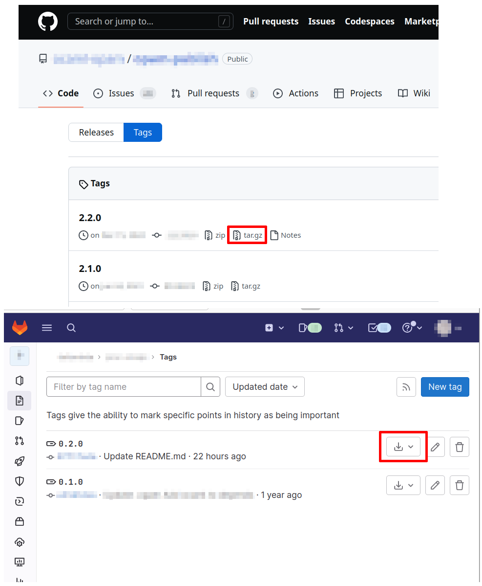

# gitlab で opam-publish をする
備忘録

## opam-publish について
opam で install できる package は,
default では https://github.com/ocaml/opam-repository で管理されているリポジトリを参照しますが,
なんとここへ自分の好きな package を追加する PR をワンコマンドで作成することができます.
それが opam-publish[^opam-publish] です.

## opam-publish する流れ
README にも書いてありますが, 一般的, つまり? project が github に置かれている場合には以下のようにして PR を作成することができます.
1. まず package として publish したい project を用意します
    - このとき適切な `PACKAGE.opam` ファイル(`PACKAGE` は任意の名前)を project の root に置く必要があります
2. `git -a TAG; git push origin TAG` 等して tag をつけて push します
3. `opam publish --tag=TAG` を叩きます
    - opam-publish は opam コマンドのプラグインとして実装されていて,
      必要ならばここでインストールされます.
4. 次のように聞かれるので, github の token を作成して入力する
    ```
    Please generate a Github token at https://github.com/settings/tokens/new to allow access.
    The "public_repo" scope is required ("repo" if submitting to a private opam repository).
    ```
    - リンクを踏むと, access token の作成のページへ飛びます. project が public の場合, `repo` 以下にある `public_repo` のところにだけチェックを入れれば十分です
5. 作成する PR の内容を確認して承認する

その結果, github に `ocaml/opam-repository` の fork を作成し, package を追加した branch を作成し,
`ocaml/opam-repository` へ PR を出すところまでやってくれます. 凄い！

もちろんこれは package を default の opam-repository へ追加する一連の操作を自動化しただけで,
別に適切にディレクトリを掘ってファイルを置くことができれば手動でやっても良いです.

PR を出したあとは (主に `PACKAGE.opam` に) 不備があれば CI に怒られるので, 適宜修正してくいことになります.
`PACKAGE.opam` を修正後に再び `opam publish` を叩くと, opam-repository の fork 先へ force push するようです.

## gitlab を使う一般的でない場合
単に `opam publish` を github で管理されている project のディレクトリ内で実行した場合,
指定した tag を元に package をインストールする際に参照すべき URL なんかを補完してくれるんですが,
そうでない場合は package をどこから落とせば良いか分からずにうまくいきません.

しかし `opam publish --help` を見るとわかるんですが,
実は github で管理されたディレクトリ内で実行する代わりに,
引数に snapshot の URL を指定することができます.
ここでいう snapshot とは github の tag[^github-tags] や release のページのから落とせる tarball だったりするわけで,
github の場合は `https://github.com/USER/REPOSITORY/archive/refs/tags/TAG.tar.gz` みたいな感じの URL が補完されていたりします.
gitlab の場合も同様に, tag[^gitlab-tags] や release のページから辿れる snapshot があり, `https://gitlab.com/USER/REPOSITORY/-/archive/TAG/PACKAGE-TAG.tar.bz2` とかで参照できます.



つまりこれを使って, `opam publish --tag=TAG https://gitlab.com/USER/REPOSITORY/-/archive/TAG/PACKAGE-TAG.tar.bz2` で gitlab で管理されている project に関しても opam-publish を使って PR を出すことができるんですね.
めでたしめでたし

## Footnote
[^opam-publish]: https://github.com/ocaml-opam/opam-publish
[^github-tags]: https://github.com/USER/REPOSITORY/tags など
[^gitlab-tags]: https://gitlab.com/USER/REPOSITORY/-/tags など
