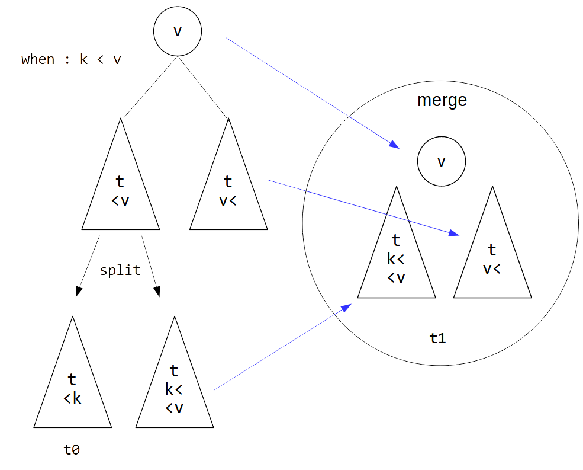

# 赤黒木のおさらいをした

やばいデータ構造の代名詞みたいな赤黒木を以前
insert/erase ベースで書きましたが, merge/split ベースで書いてみようと思い立ったので実装しました.

## 赤黒木とは

平衡二分木の一種です.
ノードが赤と黒の二種類の色[^color]を持つのが大きな特徴で,
挿入削除検索が$O(\log(n))$, 併合分割が$O(n\log(n))$ でできることが知られています.
メジャーな言語の標準ライブラリの set だとハッシュテーブルかこれが使われているので,
名前くらいは聞いたことがある人は多いと思います.

## 赤黒木の性質

赤黒木は平衡二分木なので, 任意のノードが持つ値は左のノードが持つ値より大きく, 右のノードが持つ値よりは小さいという性質は当然満たします.
その他に, ノードは赤か黒の色を持ち, 色に関して次の 3 つの性質を満たします.
1. 任意の根から葉までのパス上の黒ノードの数は一定である
2. 赤のノードは赤のノードを根に持たない
3. 根は黒である

3つ目の条件は実はなくても可能らしいですが, ここでは採用します.

そしてこれらの条件を満たす木は, 実は 2-4 木をシミュレートしていることになります.


上の画像が赤黒木, 下の画像が対応する 2-4 木です.
黒のノードと, その直接の子ノードのうち赤いノードを一つの大きなノードとして考えると,
赤ノードが連続しないという 2 つ目の性質から,
大ノードは子の大ノードを 2-4 つだけ持つこととなります.
つまり大ノードは 2-4 木のノードとして見なせて,
1 つ目の性質から 2-4 木の高さは一定です.

## insert/erase

赤黒木をやばいデータ構造たらしめているのはその実装の複雑さにあります.
木の回転, 不変条件を保った色の操作, そして何より膨大な場合分けの壁がそびえたっています.

挿入削除の場合分けについてはどうも [wikipedia](https://ja.wikipedia.org/wiki/%E8%B5%A4%E9%BB%92%E6%9C%A8) に場合分けのパターンが網羅されているようなので,
ここを見た方が早そうです.

ざっくりいうと,
- 挿入のときはノードを付ける場所を探し
, そこに赤ノードの葉を付けて,
親が赤ノードで連続している場合は祖父と叔父を見つつ
整合性を合わせるみたいな感じ
- 削除のときは削除するノードを, 葉でなければ一旦交換可能な葉のノードと値を交換して, その葉を削除し, その葉ノードが黒だった場合は親と兄弟と甥を見つつ整合性を合わせるみたいな感じ

ですかねぇ.
削除は特に大変です.[^ref]
適当な疑似コードを置いておきます.

```c
enum Color { Black, Red }
enum Side { Left=0, Right=1 }

class Node
{
    Node child[2], parent // 参照
    Color color
    Value value
}

getColor(node) : // node が null のときは Black として扱う
    if node.null || node.color == Black :
        return Black
    else :
        return Red

sideFromParent(node): // 親から見た node の方向
    parent = node.parent
    if parent.child[Left] == node :
        return Left
    else :
        return Right

setChild(node, side, child):// child の親も設定する
    node.child[side] = child
    if child != null :
        child.parent = node

rotate(node, side) : // 一般の rotate (parent と root の処理がややこしくしているだけ)
    parent = node.parent
    nodeSide = getParentSide(node)
    node1 = node.child[!side]
    node2 = node1.child[side]
    setChild(node1, side, node)
    setChild(node, !side, node2)
    if parent == null : // s.t. node == root
        root = node1
        node1.parent = null
    else:
        setChild(parent, nodeSide, node1)

maxNode(node): // node の右を辿って node が持つ最大のノードを取得する
    if node.child[Right] != null :
        maxNode(node.child[Right])
    else :
        return node

findNode(node, value): //value を持つ node を付けられる node を探す
    if value < node.value && node.child[Left] != null :
        findNode(node.child[Left], value)
    else if value > node.value && node.child[Right] != null:
        findNode(node.child[Right], value)
    else :
        return node
```

```c
add(root, value):
    if root == null :
        // 空の木にはただ node を付ける
        root = Node(value, Black)
        return

    parent = findNode(root, value)
    if parent.value == value :
        return // 既に node.value を持つノードがある

    side = value < parent.value ? Left : Right

    // parent に node を赤ノードとして付ける
    node = Node(value, Red)
    setChild(parent, side, node)
    addAux(root, node)

// node と parent が連続して赤の場合に解消するための関数
addAux(root, node): // assume node.color == Red
    if node == root :
        node.color = Black
        return
    if parent.color == Black :
        return // 整合性が合った

    // parent.color == Red
    parent = node.parent
    grandparent = parent.parent // parent.color = Red なので grandparent が存在する
    side = getParentSide(node)
    parentSide = getParentSide(parent)
    uncle = grandparent.child[!parentSide]
    switch (getColor(uncle)): // grandparent.color == Black
        case Red :
            parent.color = Black
            grandparent.color = Red
            uncle.color = Black
            addAux(root, grandparent)
            break
        case Black :
            grandparent.color = Red;
            if side != parentSide :
                node.color = Black;
                rotate(parent, !side)
                rotate(grandparent, !parentSide)
            else
                parent.color = Black
                rotate(grandparent, !parentSide)
            break
```

```c
erase(root, k):
    node = findNode(root, k)
    if node.value != k:
        return // 木が k を保持していない
    if node.child[Left] != null && node.child[Right] != null :
        // node の左から子を2つ持たないノードを探し,代わりに削除して値を入れ替える
        n = getMaxNode(node.child[Left])
        erase(root, n)
        node.value = n.value
    else : // node は子を一つしか持たない
        child = node.child[Left] != null ? node.child[Left] : node.child[Right]
        if node.color == Red || getColor(child) == Red :
            // child は null かもしれない
            child.color = Black
            if node.parent != null :
                side = sideFromParent(node)
                setChild(node.parent, side, child)
            else : // node.parent がない = node は root
                root = child
        else : // node は子を持たない && node.color == Black
            if node.parent == null : // 木 が node だけを持っている場合
                root = null
            eraseAux(node)
            node.parent.child[sideFromParent(node)] = null // node を取り除く

eraseAux(node):
    // assume node.color == Black && 取り除いた後, node 側の木が (存在すれば)brother 側の木より黒の高さが 1 低い
    parent = node.parent
    if parent == null : // node == root
        return
    side = sideFromParent(node)
    brother = parent.child[!side]
    nephew1 = brother[side] //甥1
    nephew2 = brother[!side] //甥2
    switch (parent.color, brother.color, getColor(nepher1), getColor(nepher2)) :
        case (Black, Red, Black, Black):
            parent.color = Red
            brother.color = Black
            rotate(parent, side)
            eraseAux2(node)
            //eraseAux(node) でも同じ結果
            break
        case (Black, Black, Black, Black):
            brother.color = Red
            eraseAux(parent)
            break
        case (_, Black, _, _):
            eraseAux2(node)
            break
        case _:
            assert false //赤ノードが連続している場合

// assume brother.color == Black && !(parent.color == getColor(neipher1) == getColor(neipher2) == Black)
eraseAux2(node):
    parent = node.parent
    brother = parent.child[!side]
    side = sideFromParent(node)
    nephew1 = brother[side]
    nephew2 = brother[!side]
    switch (parent, getColor(nepher1), getColor(nepher2)):
        case (Black, Black, Black):
            assert false // このケースでは removeAux2 を呼び出さない
        case (Red, Black, Black):
            parent.color = Black
            brother.color = Red
            break
        case (_, Black, Red):
        case (_, Red, Red):
            brother.color = parent.color
            parent.color = Black
            nepher2.color = Black
            rotate(parent, side)
            break
        case (_, Red, Black):
            nepher1.color = parent.color
            parent.color = Black
            rotate(brother, !side)
            rotate(parent, side)
            break

```

union, intersect, diff はいずれも insert/erase をどっちかの木の全要素に対して繰り返すだけで実装できますから, $O(n\log(m))$です.
$n < m$ の方が早いので, どちらを基準にするかには注意した方がいいです.

## merge/split
赤黒木の実装方針には insert/erase ベースと merge/split ベースの二種類があるらしいですが, こっちの方がはるかに単純です.
merge, split とは

- `merge(t0, k, t1)` : ある 2 つの木 t0, t1 と値 k に対し, t0 の要素は全て k 未満かつ t1 の要素は全て k より大きいときに t0, k, t1 を全て合わせた木を構築する操作

- `split(t, k)` : ある木 t を, 値 k より大きい要素全てと k 未満の要素全ての 2 つの木に分割する操作 (t が k を持っていたかのフラグも返すと良い)

です.
まず merge について考えます.
黒ノードに関する高さ(=葉ノードまでの黒ノードの数)を考えます.
(t0 の高さ) = (t1 の高さ) の場合は単に黒ノード k で t0 と　t1 をくっつければよいです.
そうでない場合一般性を失わずに (t0 の高さ) < (t1 の高さ) とできますが,
そのとき t1 の左の子ノードだけを辿ったときに,
t0 と同じ高さになる箇所があります.
そこに以下図のように k を持つ赤ノードを介して t0 と t1 をくっつけ, 整合性を合わせていけば merge が実現できます.


整合性の合わせ方は insert のときと近い感じで,
赤ノードが連続しないよううまいこと解消します.
(実は, あるノード n とその親ノードが赤のときに, n を黒くして n の祖父を起点に右回転するのを再帰的にするだけで良いです)

split は merge を利用して再帰的に実装できます.



さらに k なしで 2 つの木をマージする merge2 を定義すると便利です.
merge2 は, t0 の最大の要素 k を t0 から split すると
t0' と空の木が得られますが, t0' と k と t1 に対して merge をすることで実装できます.

```c
depth(node) : //黒ノードに関するの高さ
    if node == null:
        return 0
    return (node.color == Black ? 1 : 0) + depth(node.child[Left])

mergeLeft(t0, k ,t1):
	if getColor(t1) == Black && depth(t0) == depth(t1) :
		node = Node(k, Red);
		setChild(node, Left, t0)
		setChild(node, Right, t1)
    else :
        //depth(t0) < depth(t1)
        left = joinLeft(l, k, t1.child[Left])
        node = Node(t1.value, t1.color)
        setChild(node, Left, left)
        setChild(node, Right, t1.child[Right])
        // t1 の Left を left で付け替えたもの
        if node.color == Black && getColor(left) == Red && getColor(left.child[Left]) == Red :
            node.child[Left].child[Left].color = Black
            rotate(node, Right)
        
    return node

mergeRight(t0, k, t1):
   ... // mergeLeft の逆をやるだけ

merge(t0, k, t1):
    depth0 = depth(t0)
    depth1 = depth(t1)
    if depth(t0) == depth(t1):
		node = Node(k, Black)
		setChild(node, Left, t0)
		setChild(node, Right, t1)
		return node
	else :
		if depth0 < depth1 :
			node = mergeLeft(t0, k, t1)
		else if depth0 > depth1 :
			node = mergeRight(t0, k, t1)

		node.color = Black
		return node

split(t, k):
    if t == null :
        return (null, false, null)
	if t.value == key :
        t0 = t.child[Left]
        t1 = t.child[Right]
		if getColor(t0) == Red :
			t0.color = Black
		if getColor(t01) == Red :
			t1.color = Black
		return (t0, true, t1)
	else if t.value < k :
        (t2, b, t1) = split(t.child[Right], k)
        t0 = merge(t.child[Left], t.value, t2)
        return (t0, b, t1)
	else :
        (t0, b, t2) = split(t.child[Left], k)
        t1 = merge(t2, t.value, t.child[Right])
        return (t0, b, t1)

merge2(t0, t1):
    k = maxNode(t0).value
    (t0', _b, _null) = split(t0, k)
    return merge(t0', k, t1)
```

### merge/split ベースの insert/erase
insert と erase は merge, (merge2,) split を使うことで実装できます.
定数倍はよくわかりませんが愚直に insert/erase を実装するよりよほどシンプルですね.

```c
insert(root, k) :
    (t0, _, t1) = split(root, k)
    root = merge(t0, k, t1)

erase(root, k) :
    (t0, _, t1) = split(root, k)
    root = merge2(t0, t1)
```

### union
merge と split には k と t0 , t1 の大小関係という強い制約があってこのままでは使いにくいですが,
実はこれらを使って union が実装できます.


図のように,
1. t0 を t1 の root の値 k で split する
2. split で得た 2 つの 木をそれぞれ t1 の左と右の部分木と再帰的に union する
    - 2 つの union で得た木はそれぞれ k 未満と k より大きい要素からなる木である
3. union で得た 2 つの木と k を merge する

とすれば union ができます.

```c
union(t0, t1):
	if t1 == null :
        return t0
	if t0 == null :
        return t1

	(left0, b, right0) = split(t0, t1.value)
	left = union(left0, t1.child[Left])
	right = union(right0, t1.child[Right])
	return merge(left, t1.value, right)
    //どうせ破壊的操作をしているし, return じゃなくて 代入でもいい
    //t0 = merge(left, t1.value, right)
```

計算量は merge が$O(\log(n) - \log(m))$(高さの差),
split が $O(\log(n))$,
union は $O(n\log(\frac{n}{m} + 1))$ のようです[^order].
insert/erase を繰り返すよりO的には若干早いんですね.
`left` と `right` が独立に計算できるのでスケールするというメリットもあります.

### diff, intersect
これらの道具に加えて,
diff, intersect も union と同様に実装できます.
diff は, union において最後に merge する代わりに
merge2 を呼んで t1 の要素を加えないようにするだけでできます.
intersect は, union において最初に split したときに,
split した木が要素 k を持っていたかどうかを見て,
持っていれば最後に k を含めて merge,
持っていなければ merge2 をするとよいです.

```c
intersect(t0, t1): // t0 \cap t1
	if t1 == null :
        return null

	(left0, b, right0) = split(t0, t1.value)
	left = intersect(left0, t1.child[Left])
	right = intersect(right0, t1.child[Right])
    if b :
    	return merge(left, t1.value, right)
    else :
    	return merge2(left, right)

diff(t0, t1): // t0 - t1
	if t1 == null :
        return t0

	(left0, b, right0) = split(t0, t1.value)
	left = diff(left0, t1.child[Left])
	right = diff(right0, t1.child[Right])
	return merge2(left, t1.value, right)
```

## 実装
insert/erase ベースは特に気を抜くとすぐバグりましたね.
よくあったのが,
- node の子供の色で場合分けしようとするんですが,
赤か黒かだけじゃなくてそもそも子供が存在するかということに気を付けないとすぐセグフォします
- 子供を付け替えたりするときに, 子供から見た親をちゃんと指定するのを忘れていると, 木がループし始めます
- 親をたどるときに, ノードが根だと辿れずセグフォします

気合で頑張りましょう. merge/split ベースでもマシとはいえ同じ落とし穴はあるので気を付けないといけないですね.

久しぶりに c++ で書いてみたんですが, c++ 特有の事情として
- rotate が必要な木だとそうですが, c++ だと `shared_ptr` はともかく `weak_ptr` の使いどころ
    - Node は `enable_shared_from_this` を継承すると `this->shared_from_this()` で this ポインタから `shared_ptr`` が生成できて吉
- `initializer_list` コンストラクタを書いておくと吉
    - 要素数以下の最大の (2の冪-1) を完全二分木の黒ノード, 残りを赤ノードで先っぽにつけるように生成すると $O(n)$ で構築できて嬉しいですが, やや面倒
        - エントロピーを考えると, 2-4 木における 3 分木で構築するのが一番良いらしいが, 大変そう
- 要求されているメンバを定義すると STL で使える Iterator になるんですね
    - `begin`, `end`, `*`, `++`, `iterator_category`
- 宣言と実装を分けると無限に `template` って書かされるの何とかなりませんかね


<https://github.com/taiseiKMC/CompetitivePrograming/blob/master/RedBlackTree.cpp>

(プロコンで使うことを想定して書いたので, `using namespace = std` 等テンプレートを前提にしてます)

# Footnote
[^color]: [wikipedia](https://en.wikipedia.org/wiki/Red%E2%80%93black_tree) 曰く, レーザープリンターで印刷したときの色が映えるから赤が選ばれたらしい
[^ref]: [みんなのデータ構造](https://www.amazon.co.jp/%E3%81%BF%E3%82%93%E3%81%AA%E3%81%AE%E3%83%87%E3%83%BC%E3%82%BF%E6%A7%8B%E9%80%A0-Pat-Morin/dp/4908686068) を参考に実装したような気がします
[^order]: <https://en.wikipedia.org/wiki/Red%E2%80%93black_tree>, <https://shifth.hatenablog.com/entry/2015/05/10/103528>