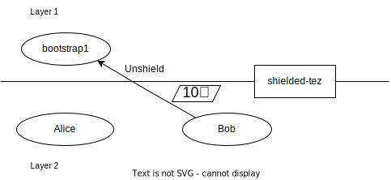
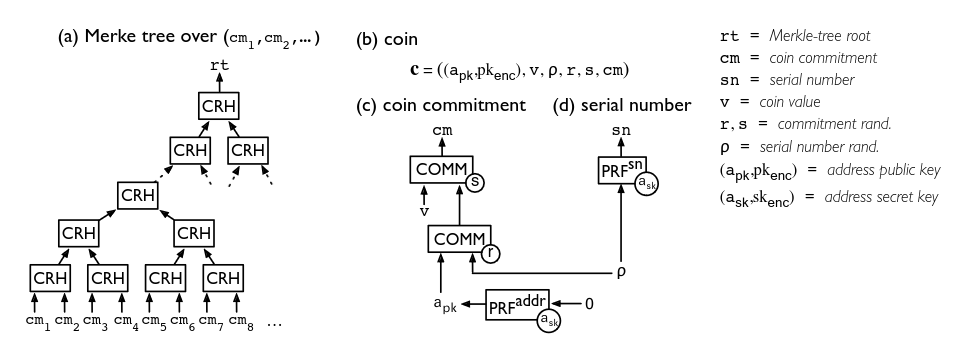
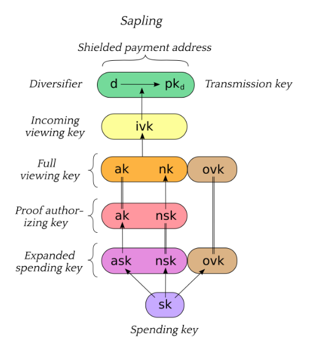

<link rel="stylesheet" type="text/css" href="style.css" />

# Sapling protocol と向き合う

Sapling protocol とは zcash で定義された, ゼロ知識証明 zk-SNARK(zero-knowledge Succinct Non-interactive ARgument of Knowledge) を使ってトークンの送受信情報を匿名化したブロックチェーンプロトコルです.
一般にブロックチェーン上のアドレス間の送受信情報は公開されていて誰でも閲覧追跡できますが,
本プロトコルを使うとそれすら秘匿することができます.
最初に zerocash[^zcash] という名前で Bitcoin 内に匿名化に対応したコインを導入するする実装がされ,2nd layer の実装手法の一つとして Ethereum や Tezos などでも応用されています.
ゼロ知識証明を使った 2nd layer 実装技術は zk-rollup とか pessimistic-rollup[^optimistic-rollup] とか呼ばれています.

### そもそも何ができるか
Sapling を実装した tezos の sandbox 上で送受信する例をみてみます.

<https://tezos.gitlab.io/active/sapling.html>

```shell
# set up the sandbox
./src/bin_node/octez-sandboxed-node.sh 1 --connections 0 &
eval `./src/bin_client/octez-init-sandboxed-client.sh 1`
octez-activate-alpha

# originate the contract with its initial empty sapling storage,
# bake a block to include it.
# { } represents an empty Sapling state.
octez-client originate contract shielded-tez transferring 0 from bootstrap1 \
running src/proto_alpha/lib_protocol/test/integration/michelson/contracts/sapling_contract.tz \
--init '{ }' --burn-cap 3 &
octez-client bake for bootstrap1

# if necessary, you can get information from the octez-client manual
octez-client sapling man

# generate two shielded keys for Alice and Bob and use them for the shielded-tez contract
# the memo size has to be indicated
octez-client sapling gen key alice
octez-client sapling use key alice for contract shielded-tez --memo-size 8
octez-client sapling gen key bob
octez-client sapling use key bob for contract shielded-tez --memo-size 8

# generate an address for Alice to receive shielded tokens.
octez-client sapling gen address alice
zet1AliceXXXXXXXXXXXXXXXXXXXXXXXXXXXXXXXXXXXXXXXXXXXXXXXXXXXXXXXXXX # Alice's address


# shield 10 tez from bootstrap1 to alice
octez-client sapling shield 10 from bootstrap1 to zet1AliceXXXXXXXXXXXXXXXXXXXXXXXXXXXXXXXXXXXXXXXXXXXXXXXXXXXXXXXXXX using shielded-tez --burn-cap 2 &
octez-client bake for bootstrap1
octez-client sapling get balance for alice in contract shielded-tez

# generate an address for Bob to receive shielded tokens.
octez-client sapling gen address bob
zet1BobXXXXXXXXXXXXXXXXXXXXXXXXXXXXXXXXXXXXXXXXXXXXXXXXXXXXXXXXXXXX # Bob's address

# forge a shielded transaction from alice to bob that is saved to a file
octez-client sapling forge transaction 10 from alice to zet1BobXXXXXXXXXXXXXXXXXXXXXXXXXXXXXXXXXXXXXXXXXXXXXXXXXXXXXXXXXXXX using shielded-tez

# submit the shielded transaction from any transparent account
octez-client sapling submit sapling_transaction from bootstrap2 using shielded-tez --burn-cap 1 &
octez-client bake for bootstrap1
octez-client sapling get balance for bob in contract shielded-tez

# unshield from bob to any transparent account
octez-client sapling unshield 10 from bob to bootstrap1 using shielded-tez --burn-cap 1
ctrl+z # to put the process in background
octez-client bake for bootstrap1
fg # to put resume the transfer
```
{: style="overflow-y: auto"}


[`src/proto_alpha/lib_protocol/test/integration/michelson/contracts/sapling_contract.tz`](https://gitlab.com/tezos/tezos/-/blob/master/src/proto_alpha/lib_protocol/test/integration/michelson/contracts/sapling_contract.tz) は zk-rollup における L2(Layer-2) の状態を Layer1 で管理するためのコントラクトです.
中身は L2 上のトランザクション `sapling_transaction` の列を受け取り, `sapling_state` を更新して保存するみたいな感じのシンプルな感じです[^memo].

上の例では,
- `sapling_state` を管理するコントラクト shielded-tez をデプロイ
- alice と bob という名前でデプロイしたコントラクトの管理する L2 上のアカウントを生成
- sandbox 上のデフォルトアカウント bootstrap1 から L2 の alice へ送金する
- L2 の alice から bob へ送金する
  - この送金のトランザクション `sapling_transaction` は sandbox 上の別のデフォルト bootstrap2 が行う
- L2 の bob から L1 の bootstrap1 へ送金する

が行われています. 

{:.center}
{:.center}
{:.center}
{:.center}


このとき,
- bootstrap1 から shielded-tez への送金は公開されている
  - shielded-tez は L2 上のすべての残高の合計を保持する(pool している)
  - bootstrap1 が L2 上のどのアカウントへ送金したのかは分からない
- bootstrap2 が送ったトランザクションからは内部でどんな送金が行われたのかは全く分からない
  - トランザクションの作成は alice の proving key(秘密鍵みたいなもの)を持つ者と bob のviewing key(公開鍵みたいなもの)を持つ者が行うことができる
  - L2 のトランザクションを L1 のコントラクトへ送る, いわゆるシーケンサは誰でも良い
- shielded-tez から bootstrap1 への送金は公開されている
  - bootstrap1 が shielded-tez の管理する L2 のアカウントのうち, 残高の持つどれかのアカウントの proving key (秘密鍵に近い)を持っていることは分かる
  - しかしどこから湧いてきたのかは分からない

つまり, L1 と L2 間のやり取りは見えてますが,
L2 で何が起きたのかは何も分からないという感じです.
L2 のアカウントが少ないと L1 と L2 間のやり取りでキャッシュフローが筒抜けになってしまいますが,
大規模になれば Mixer[^mixer] と違って追跡は難しいでしょう.

## zerocash
sapling の内部で何が起こっているのかを理解したかったのですが, これ自体複雑で難解です.
[一次ソース](https://github.com/zcash/zips/blob/main/protocol/sapling.pdf) 
なんかは Sprout と Sapling の 2 バージョン混ざって載った zcash 全体のプロトコルとかで 150p もあって膨大です.

今回は sapling を理解するより先に, 元となった [zerocash](http://zerocash-project.org/media/pdf/zerocash-oakland2014.pdf) の論文を読んで理解しようとしてみます.


### zerocash の仕組み
zerocash は bitcoin を拡張して匿名化した送金のトランザクションを可能にした実験的な実装です.
zerocash の匿名化した世界のノードは状態として, Merkle-tree と Nullifier-Set[^snlist] を持っています.
Merkle-tree はその葉に coin-commitment を保持しています.
coin-commitment は

$$
\begin{aligned}
  k := COMM_r(a_{pk} \parallel \rho)\\
  cm := COMM_s(v \parallel k)
\end{aligned}
$$

で計算される $$cm$$ です. ここで,
- $$COMM$$ は statistically-hiding non-interactive commitment scheme と呼ばれる関数で,
  ランダムな $$r$$ とメッセージ $$m$$ に対し, $$c := COMM_r(m)$$ は $$c$$ から元の $$m$$ を推測するのが難しく,
  $$c = COMM_r(m')$$ を満たすような他の $$m'$$ を見つけるのも難しくて,
  $$r$$ と $$m$$ を開示すると $$c = COMM_r(m)$$ を満たすことが確認できる関数らしいです.
  - hash 関数でよいです
- $$a_{pk}$$ は鍵ペア $$(a_{pk}, a_{sk})$$ の公開されている方です.
  これ自体はどうも公開鍵ではないようで, $$a_{pk} = PRF^{addr}_{a_{sk}}(0)$$ で定義されています.
  - $$PRF$$ は疑似乱数生成関数で, これも中身は hash 関数でよいです. $$PRF^{addr}$$ はアドレス用という意味で, 署名用の $$PRF^{pk}$$ も後で使います
- $$\rho$$ は何らかの秘密の値
- $$r, s$$ は任意の乱数
- $$v$$ はトークンの量を表す値

です.
*コイン* $$c$$ はこれらの組 $$(a_{pk}, v, \rho, r, s, cm)$$ と考えることができます.

Nullifier-Set は,シリアルナンバー
$$sn := PRF^{sn}_{a_{sk}}(\rho)$$ の集合です.

{:.center}

(zerocash の論文より)
図中の CRH は衝突耐性のあるハッシュ関数です.

このプロトコルでは mint と pour の 2 種類のトランザクションを発行することができます.
- mint : コインを残高が公開されている bitcoin の世界から, 匿名の zerocash の世界へ移す操作
- pour : zerocash の世界の残高を別の zercash または bitcoin のアドレスへ送る操作

mint をする場合は, 上で定義した*コイン*に対し, mint トランザクション $$(v, k, s, cm)$$ を発行します.
$$cm := COMM_s(v \parallel k)$$ を計算することで $$v$$ を送るトランザクションということは誰でも確認できます(つまり外の世界から v が pool へ送られていなければおかしいことが分かります).
しかし $$a_{pk}$$ は公開されていないためどのアドレスへ送ったかはわかりません.

pour をする場合を考えます.
pour では所有している複数の既存の*コイン* $$c^{from}_i$$ を
複数の別のアカウントへ紐つけられた *コイン* $$c^{to}_i$$ へ変換します.
もし*コイン*中の量の合計の差 $$v_{pub} = \sum_i v^{from}_i - \sum_i v^{to}_i$$ があれば,
それは zerocash の世界から bitcoin の世界への送金としてそのトランザクションを実行したアカウントへ pool から送られます.
送信者は送信先のアドレス $$a^{to}_{pk,i}$$ と贈りたいトークンの量 $$v^{to}_i$$ に対し,
$$\rho^{to}_i, r^{to}_i, s^{to}_i$$ を生成して*コイン* $$c^{to}_i$$ を計算して生成します.
そして最後に zk-SNARK を使って以下の証明 $$\pi$$ を生成します.

- Merkel-tree の root $$rt$$, シリアルナンバー $$sn^{from}_i$$, coin-commitment $$cm^{to}_i$$, 外の世界へ送るトークン量 $$v_{pub}$$ に対し, *コイン* $$c^{from}_i$$, $$c^{to}_i$$ と送信者の秘密鍵 $$a^{from}_{sk}$$ は
  - *コイン*は well-formed である. つまり, $$c^{from}_i$$ に対して $$k^{from}_i = COMM_{r^{from}_i}(a^{from}_{pk,i} \parallel \rho^{from}_i),
  cm^{from}_i = COMM_{s^{from}_i}(v^{from}_i \parallel k^{from}_i)$$ が成り立ち, $$c^{new}_i$$ も同様である
  - $$a_{sk}$$ は $$a^{from}_{pk,i}$$ と鍵ペアをなす. つまり, $$a^{from}_{pk,i} = PRF^{addr}_{a_{sk}}(0)$$
  - シリアルナンバー $$sn^{from}_i$$ は正しく計算されている. つまり, $$sn^{from}_i = PRF^{sn}_{a_{sk}}(\rho^{from}_i)$$ である
  - coin-commitment $$cm^{from}_i$$ は root が $$rt$$ の Merkle-tree の葉に現れる
  - 送受信するトークンの量が等しい. つまり, $$\sum_i v^{from}_i = v_{pub} + \sum_i v^{to}_i$$ である

このとき pour トランザクションは $$(rt, sn^{from}_i, cm^{to}_i, v_{pub}, \pi)$$ です.

公開されているのは mint と pour のトランザクションの列になります.
各々のノードはそこから coin-commitment の merkle-tree と nullifier-set を構築できます.
しかしこれだとトークンを送られた本人ですらどの coin-commitment が自分の*コイン*で, いくら保有しているのかも分かりません. 別途安全な通信路で教えるということでも良いですが, 便宜上 pour トランザクションには $$(v^{to}_i, \rho^{to}_i, r^{to}_i, s^{to}_i)$$ を秘密鍵で暗号化した暗号文が付随しています. これは $$a_{sk}$$ とは別に用意した公開鍵でやります. 各アカウントは pour トランザクションをスキャンすることで自分宛ての送金を検出して自分の保有する*コイン*の情報を得られます.

さらに, この付与した暗号文がすり替えられるのを防ぐため, MAC(メッセージ認証コード)をつけます.
具体的には,
1. 鍵ペア $$(pk_{sig}, sk_{sig})$$ を生成
2. $$h_{sig} = CRH(pk_{sig})$$ を計算
3. $$h_i = PRF^{pk}_{a^{from}_{sk, i}}(h_{sig})$$ を計算
  - これが MAC
4. $$sk_{sig}$$ で pour トランザクションを署名し, 署名 $$\omega$$ を付与する

をします. 生成するゼロ知識証明にも $$h_{sig}, h_i$$ の有効性の証明を加える必要がありますが, ここでは省略します.

zerocash は bitcoin と同様の UTXO モデルになっています.
しかし coin-commitment は匿名性のためにどれが既に使われた*コイン*を表すのか判別がつきません(逆にどれが使用済みか分かってしまうと, mint トランザクションから追跡できてしまいます).
そこで二重消費を防ぐためにあるのがシリアルナンバーと Nullifier-Set です.
*コイン*を消費するたびにシリアルナンバーを公開し, Nullifier-Set へ追加していますから, もし Nullifier-Set に既にあるシリアルナンバーを使用しようとすれば二重消費が検出できるというわけです.

### zk-SNARKs
zk-SNARK は以下の 3 アルゴリズム(KeyGen, Prove, Verify) の組です.

$$
\begin{aligned}
(pk, vk) \leftarrow \text{KeyGen}(1^\lambda, C)\\
\pi \leftarrow \text{Prove}(pk, x, a)\\
b \leftarrow \text{Verify}(vk, x, \pi)
\end{aligned}
$$

ここで
- $$\mathbf{F}$$ はある体(field)
- $$\lambda$$ はセキュリティビット数,
- $$C : \mathbb{F}^n \times \mathbb{F}^h \rightarrow \mathbb{F}^l$$ は体上の算術回路
- $$x \in \mathbb{F}^n$$ は主張(instance とも), $$a \in \mathbf{F}^h$$ は補助入力(witness とも)で, $$C(x, a) = 0^l$$を満たす
- $$\pi$$ は証明
- $$b$$ は boolean

です.
KeyGen は信頼できる第三者が実行して pk を生成し,
Prove を実行する者にとって都合の良い入力にならないように制限をかけるためのものです.

zk-SNARK である条件としては,
- 完全性 : 正直な prover に対して verifier は(無視できる確率を除いて)正しいと確信できる
- 知識の証明 (健全性) : verifier は prover の生成する証明 $$\pi$$ によって, 主張 $$x$$ に対する $$a$$ を知っていると確信できる.
  - 正確には, 任意の(敵対的な)入力生成器$$A$$ の生成した値 $$(x, \pi) \leftarrow A(pk)$$ に対して,
  $$\text{Verify}(vk, x, \pi) = \text{true} \rightarrow C(x, a) = 0^l$$ が(無視できる確率を除いて)成り立つような
   $$a = E(pk)$$ (Extractor)が存在する
- 簡潔性: $$\pi$$ の大きさは $$\lambda$$ に比例, Verify の実行時間は $$\lambda + x$$に比例するくらい小さい
- ゼロ知識性: verifier は prover の $$a$$ やその生成方法に関する情報を得ることはできない

です.

このような zk-SNARK の要件を満たすアルゴリズムは複数知られているらしいので, zk-SNARKs と複数形で呼ばれています.
ここでは zk-SNARK を満たす具体的なアルゴリズムには触れません.

### zerocash における zk-SNARK
KeyGen は信頼できる第三者が最初に一度だけ行い, $$(pk, vk)$$ を生成します.
信頼できる第三者がランダムに生成しない場合,
不正な pour トランザクションを生成できたりトークン量の不変条件が崩れたりするらしいです.
L2 として実装している巷のブロックチェーンではスマートコントラクトがこの役割を担い,
最初にデプロイするときに KeyGen しています.

zk-SNARK は前述の通り pour のトランザクションを検証するのに使います.
$$\text{Prove}(pk, x, a)$$ の具体的なアルゴリズムは使用する zk-SNARK に依存しますが,
使う主張と補助入力は

$$
\begin{aligned}
x = (rt, sn^{from}_i, cm^{to}_i, v_{pub})\\
a = (path_i, c^{from}_i, c^{to}_i, a_{sk})
\end{aligned}
$$

ただし, $$path_i$$ は Merkle-tree における $$rt$$ から $$cm^{from}_i$$ までのパスです.

ここまで来ると大体想像がつくかもしれませんが,
zk-SNARK の算術回路 $$C$$ には $$x$$ と $$a$$ が満たして欲しい性質を埋め込みます. つまり,

- *コイン*の well-formed 性: $$k^{from}_i = COMM_{r^{from}_i}(a^{from}_{pk,i} \parallel \rho^{from}_i),
cm^{from}_i = COMM_{s^{from}_i}(v^{from}_i \parallel k^{from}_i)$$ ($$c^{new}_i$$ も同様)
- $$a^{from}_{pk,i}$$ の有効性: つまり, $$a^{from}_{pk,i} = PRF^{addr}_{a_{sk}}(0)$$
- シリアルナンバーの正しさ: $$sn^{from}_i = PRF^{sn}_{a_{sk}}(\rho^{from}_i)$$
- coin-commitment の存在性: $$cm^{from}_i$$ は root が $$rt$$ の $$path_i$$ を辿った先にある
- トークンの不変条件: $$\sum_i v^{from}_i = v_{pub} + \sum_i v^{to}_i$$

がエンコードされています. $$COMM$$ と $$PRF$$ は hash 関数が使われていましたね. つまり最後のトークンの不変条件以外は hash 関数の一致をひたすら検証しているだけなので, 回路のほとんどは hash 関数になります.

## zerocash と sapling の違い
Sapling protocol は zcash 上で実装された 2 つ目[^sprout]のプロトコルです.

Sapling には鍵が5種類くらい定義されています. 
これは用途ごとに細かく権限を制御するために分けられてます.

{:.center}

(sapling protocol specification 3.1 p12 より)

- Spending key : 大本の秘密鍵. 厳重に保管する
- Expanded spending key : トークンを送るのに使う. 普段使い用
- Proof authorizing key : 証明を作成するのに使う. 重い証明の作成を別のマシンでやりたいときなどに便利
- Full viewing key : トークンを受け取るトランザクションと送るトランザクションの両方が閲覧できる
- Incoming viewing key : 受け取るトランザクションだけ閲覧できる
- Diversifier : アドレスを生成できる

他にも実装上の違いは色々ありそうですが, 一番の違いは多分
- pour を一般化した結果 mint の機能を兼ねるようになり, mint がなくなった
- pour が分割され, コインの from を処理するトランザクション Spend と, to を処理するトランザクション Output の 2 つになっている

かなーと思います.
こうして分けることで zk-SNARK の証明が小さくできるという利点があるらしいです.
また, 対応する Spend と Output の間にはトークン量の不変条件(つまり, 送った
量と受け取った量が等しい)が成り立つ必要がありますが,
それは別途 Pedersen Commitment というのを使って示しているらしいです.


# Reference
- Tezos Sapling support: <https://tezos.gitlab.io/active/sapling.html>
- Zcash protocol specification : <https://github.com/zcash/zips/blob/main/protocol/sapling.pdf>
  - Sapling protocol の specification
- Zerocash: Decentralized Anonymous Payments from Bitcoin (extended version) : <http://zerocash-project.org/media/pdf/zerocash-extended-20140518.pdf>
- Succinct Non-Interactive Arguments via Linear Interactive Proofs : <https://eprint.iacr.org/2012/718.pdf>
  - zk-SNARK の定義
- zk-SNARKs の理論 : <https://zenn.dev/kyosuke/articles/a1854b9be26c01df13eb>

# Footnote
[^zcash]: 似たようなやつらがいます ([出典](https://bitcoin.stackexchange.com/questions/79118/zerocoin-vs-zerocash-are-they-the-same-or-two-different-protocols)) zerocoin : zerocash の先行研究, 送信元だけ匿名化, zerocash : zerocoin と比べて, 送信先, 送信するトークンの量を匿名化, zcash : bitcoin 上ではなく独自コインとして zerocash を実装
[^optimistic-rollup]: pessimistic があるということは optimistic もあります. pessimistic の方はブロックチェーン上で検証済みのコミットしか受理されませんが, optimistic の方は誰かに反証されるまで検証しません.
[^memo]: tezos の sapling の型は謎の integer を受け取ります. これは sapling のトランザクションに付与できる受信者だけが見られる文字列メモの最大長らしいです. メモ自体は sapling protocol で定義されています.
[^mixer]: 複数のアカウントから送られてきた残高を鍵付きで保管して, 複数のアカウントへ送る Mixer というコントラクトが一般に知られていて, マネロンの用途で使われるらしいですが, 送信者と受信者のアドレスもその総金額も公開されているのでどれだけ意味があるのか不明です. その点 sapling は追跡不能なので逆にどこかのプロトコルでは禁止されたとか
[^snlist]: 論文中では $$\text{SNList}$$ と呼ばれています
[^sprout]: 1 つ目は Sprout と呼ばれています
